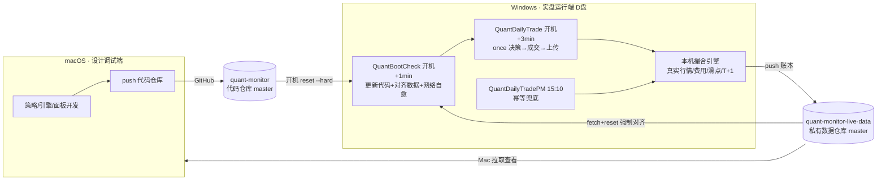

---
tags:
  - 量化监控
  - Windows部署
  - 实盘架构
  - 自动化
  - 撮合引擎
created: 2026-10-06
milestone: 底层架构跑通，转入UI打磨
related:
  - "[[windows-deployment-runbook]]"
  - "[[quant-live-architecture-2026-10-06]]"
---

# 实盘运行架构与自动化边界（2026-10-06 定型）

> [!abstract] 一句话
> Mac 负责"设计/调试"，Windows 负责"实盘运行"，GitHub 双仓库做唯一中转与真相源；Windows 上一次管理员点火后，**每天开机即自动更新、成交、上传、刷新，零点击**。系统是**模拟盘**：真实行情 + 本机真实撮合 + 真实记账，但**绝不接任何券商真实账号**。

## 一、双机双仓库拓扑

- 代码仓库：`you9095/quant-monitor`（master）。
- 数据仓库：`you9095/quant-monitor-live-data`（私有，唯一真相源，master）。
- Windows 代码在 `D:\quant-monitor`（**不放 C 系统盘**），Python 3.11.9 venv。

## 二、交易日下午自动运行时序（用户 13:00–17:00 开机）

| 时刻 | 任务 | 动作 | 是否成交 |
|---|---|---|---|
| 登录 +1min | QuantBootCheck | 代码 `reset --hard origin/master`、数据仓库强制对齐、SSH443/SSH22/HTTPS 网络自愈、上报心跳 | 否 |
| 登录 +3min | QuantDailyTrade | 更新→装依赖→`run_daily_engine.py once`→push→心跳→重启面板（仅工作日 13–17 窗口） | 是（当日首次） |
| 15:10 | QuantDailyTradePM | 再跑一次 trade，收盘兜底；当日已成交则全部幂等跳过 | 视情况 |

- **once 单段式**：历史收盘算动量目标 → 开机时刻最新价（盘中实时 / 收盘后收盘 / 缺失日线兜底，记 `price_source`）→ T+1 结算 → 真实撮合 → 记净值写账本。
- **当日幂等**：`daily/<today>/<sid>.json` 已有 `phase=trade` 即跳过，重复触发绝不重复成交。
- **非交易日不成交**：以新浪 A 股交易日历为准（`data/trade_calendar.json` 兜底），休市日开机也不拿旧价误成交。

## 三、自动化的边界（为什么第一次仍需管理员点一次）

> [!info] 引导困境 + UAC
> 全新电脑上没有代码/Python/计划任务，"第一个自动程序"无法自己创建自己；创建系统计划任务受 Windows UAC 约束，必须真人点一次授权。这是**整台机器一生一次的点火**，不是日常步骤。

| 变更类型 | 自动下发？ | 需手动？ |
|---|---|---|
| 策略/行情/风控/面板/脚本等内容层 | ✅ 开机自动拉取 | 否 |
| 每日成交/上传/刷新/网络自愈 | ✅ 全自动 | 否 |
| 改计划任务触发器结构、装系统组件 | ❌ | 极少数情况管理员一次 |
| 换电脑 / 重装系统 | ❌ | 新机器管理员一次 |

## 四、数据性质与隔离（铁律）

- 面板任何数字必须标注：**实盘模拟（本机真实撮合，非回测，不接券商）/ 回测 / UI测试虚拟数据**。
- 禁止快照、前向填充、随机数、回测冒充实盘、未启动占位；没有真实数据就留空。参见 [[PROJECT_RULES]] 规则 2/5/7。
- **UI 打磨期虚拟数据**：只能放隔离目录/分支/端口，**绝不进 live-data、绝不 push**，界面标注"UI 测试虚拟数据"，用完即弃。

## 五、归零与首交易日

- 2026-10-06 17:00 Mac 定时跑 `scripts/reset_accounts.py`：六策略现金 1 万/空仓，清 daily/latest/_run_logs（保留 .gitkeep 与部署心跳），写 `_reset_marker.json` 并 push。
- 国庆 10-01~10-07 休市，**2026-10-08（周四）= 节后首个交易日**；Windows 13–17 点正常开机即可，收盘后从数据仓库核验六策略首笔真实成交与 `price_source`。

## 六、故障兜底清单
- 连不上 GitHub：SSH 走 `ssh.github.com:443` → SSH22 → HTTPS，自动探测本地代理 7890/7897。
- 行情接口失败：用日线收盘兜底；交易日历失败用本地缓存，再退回 weekday+盘后日线复核。
- 数据仓库脏/冲突：开机 `fetch + reset --hard origin/master` 强制对齐。
- 观察 Windows 唯一远程通道是数据仓库心跳；连 GitHub 前是物理盲区。

## 关联文档
- 操作手册：[[windows-deployment-runbook]]
- 安装器复盘：根目录 `POSTMORTEM_Windows一键安装器八版失败_2026-10-04.md`
- 工作日志：`work_logs/2026-10-04_Windows一键安装器v9成功与部署复盘.md`、`work_logs/2026-10-06_部署落地交易日历加固与转入UI打磨.md`
- 单文件记忆：`memory/quant-live-architecture-2026-10-06.md`、`memory/windows-installer-v9-polyglot.md`
